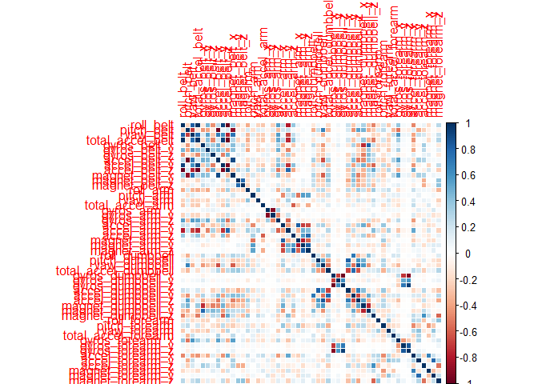
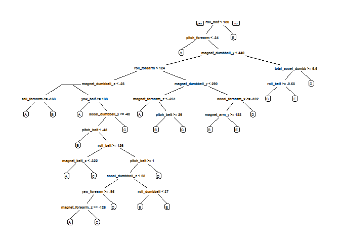

# Practical Machine Learning Course Project
#Introduction
Using devices such as Jawbone Up, Nike FuelBand, and Fitbit it is now possible to collect a large amount of data about personal activity relatively inexpensively. These type of devices are part of the quantified self movement - a group of enthusiasts who take measurements about themselves regularly to improve their health, to find patterns in their behavior, or because they are tech geeks. One thing that people regularly do is quantify how much of a particular activity they do, but they rarely quantify how well they do it.

In this project, we will be using data from Groupware@LES where the data is gathered from accelerometers on the belt, forearm, arm, and dumbbell of 6 participants to predict the manner that the exercise was performed. They were asked to perform barbell lifts correctly and incorrectly in 5 different ways. More information is available from the website here: http://groupware.les.inf.puc-rio.br/har (see the section on the Weight Lifting Exercise Dataset).

#Loading the Data 
The training data for this project are available here: 
https://d396qusza40orc.cloudfront.net/predmachlearn/pml-training.csv

The test data are available here: 
https://d396qusza40orc.cloudfront.net/predmachlearn/pml-testing.csv

The data for this project come from this source: http://groupware.les.inf.puc-rio.br/har.

```r
setInternet2(use = TRUE)
url="https://d396qusza40orc.cloudfront.net/predmachlearn/pml-training.csv"
download.file(url,destfile = "pml-training.csv")

url="https://d396qusza40orc.cloudfront.net/predmachlearn/pml-testing.csv"
download.file(url, destfile = "pml-testing.csv")

pTrain<-read.csv("pml-training.csv", header=T, na.strings=c("NA", "#DIV/0!"))
pTest<-read.csv("pml-testing.csv", header=T, na.string=c("NA", "#DIV/0!"))
summary(pTrain)
```

```
##        X            user_name    raw_timestamp_part_1 raw_timestamp_part_2
##  Min.   :    1   adelmo  :3892   Min.   :1.322e+09    Min.   :   294      
##  1st Qu.: 4906   carlitos:3112   1st Qu.:1.323e+09    1st Qu.:252912      
##  Median : 9812   charles :3536   Median :1.323e+09    Median :496380      
##  Mean   : 9812   eurico  :3070   Mean   :1.323e+09    Mean   :500656      
##  3rd Qu.:14717   jeremy  :3402   3rd Qu.:1.323e+09    3rd Qu.:751891      
##  Max.   :19622   pedro   :2610   Max.   :1.323e+09    Max.   :998801      
##                                                                           
##           cvtd_timestamp  new_window    num_window      roll_belt     
##  28/11/2011 14:14: 1498   no :19216   Min.   :  1.0   Min.   :-28.90  
##  05/12/2011 11:24: 1497   yes:  406   1st Qu.:222.0   1st Qu.:  1.10  
##  30/11/2011 17:11: 1440               Median :424.0   Median :113.00  
##  05/12/2011 11:25: 1425               Mean   :430.6   Mean   : 64.41  
##  02/12/2011 14:57: 1380               3rd Qu.:644.0   3rd Qu.:123.00  
##  02/12/2011 13:34: 1375               Max.   :864.0   Max.   :162.00  
##  (Other)         :11007                                               
##    pitch_belt          yaw_belt       total_accel_belt kurtosis_roll_belt
##  Min.   :-55.8000   Min.   :-180.00   Min.   : 0.00    Min.   :-2.121    
##  1st Qu.:  1.7600   1st Qu.: -88.30   1st Qu.: 3.00    1st Qu.:-1.329    
##  Median :  5.2800   Median : -13.00   Median :17.00    Median :-0.899    
##  Mean   :  0.3053   Mean   : -11.21   Mean   :11.31    Mean   :-0.220    
##  3rd Qu.: 14.9000   3rd Qu.:  12.90   3rd Qu.:18.00    3rd Qu.:-0.219    
##  Max.   : 60.3000   Max.   : 179.00   Max.   :29.00    Max.   :33.000    
##                                                        NA's   :19226     
##  kurtosis_picth_belt kurtosis_yaw_belt skewness_roll_belt
##  Min.   :-2.190      Mode:logical      Min.   :-5.745    
##  1st Qu.:-1.107      NA's:19622        1st Qu.:-0.444    
##  Median :-0.151                        Median : 0.000    
##  Mean   : 4.334                        Mean   :-0.026    
##  3rd Qu.: 3.178                        3rd Qu.: 0.417    
##  Max.   :58.000                        Max.   : 3.595    
##  NA's   :19248                         NA's   :19225     
##  skewness_roll_belt.1 skewness_yaw_belt max_roll_belt     max_picth_belt 
##  Min.   :-7.616       Mode:logical      Min.   :-94.300   Min.   : 3.00  
##  1st Qu.:-1.114       NA's:19622        1st Qu.:-88.000   1st Qu.: 5.00  
##  Median :-0.068                         Median : -5.100   Median :18.00  
##  Mean   :-0.296                         Mean   : -6.667   Mean   :12.92  
##  3rd Qu.: 0.661                         3rd Qu.: 18.500   3rd Qu.:19.00  
##  Max.   : 7.348                         Max.   :180.000   Max.   :30.00  
##  NA's   :19248                          NA's   :19216     NA's   :19216  
##   max_yaw_belt   min_roll_belt     min_pitch_belt   min_yaw_belt  
##  Min.   :-2.10   Min.   :-180.00   Min.   : 0.00   Min.   :-2.10  
##  1st Qu.:-1.30   1st Qu.: -88.40   1st Qu.: 3.00   1st Qu.:-1.30  
##  Median :-0.90   Median :  -7.85   Median :16.00   Median :-0.90  
##  Mean   :-0.22   Mean   : -10.44   Mean   :10.76   Mean   :-0.22  
##  3rd Qu.:-0.20   3rd Qu.:   9.05   3rd Qu.:17.00   3rd Qu.:-0.20  
##  Max.   :33.00   Max.   : 173.00   Max.   :23.00   Max.   :33.00  
##  NA's   :19226   NA's   :19216     NA's   :19216   NA's   :19226  
##  amplitude_roll_belt amplitude_pitch_belt amplitude_yaw_belt
##  Min.   :  0.000     Min.   : 0.000       Min.   :0         
##  1st Qu.:  0.300     1st Qu.: 1.000       1st Qu.:0         
##  Median :  1.000     Median : 1.000       Median :0         
##  Mean   :  3.769     Mean   : 2.167       Mean   :0         
##  3rd Qu.:  2.083     3rd Qu.: 2.000       3rd Qu.:0         
##  Max.   :360.000     Max.   :12.000       Max.   :0         
##  NA's   :19216       NA's   :19216        NA's   :19226     
##  var_total_accel_belt avg_roll_belt    stddev_roll_belt var_roll_belt    
##  Min.   : 0.000       Min.   :-27.40   Min.   : 0.000   Min.   :  0.000  
##  1st Qu.: 0.100       1st Qu.:  1.10   1st Qu.: 0.200   1st Qu.:  0.000  
##  Median : 0.200       Median :116.35   Median : 0.400   Median :  0.100  
##  Mean   : 0.926       Mean   : 68.06   Mean   : 1.337   Mean   :  7.699  
##  3rd Qu.: 0.300       3rd Qu.:123.38   3rd Qu.: 0.700   3rd Qu.:  0.500  
##  Max.   :16.500       Max.   :157.40   Max.   :14.200   Max.   :200.700  
##  NA's   :19216        NA's   :19216    NA's   :19216    NA's   :19216    
##  avg_pitch_belt    stddev_pitch_belt var_pitch_belt    avg_yaw_belt     
##  Min.   :-51.400   Min.   :0.000     Min.   : 0.000   Min.   :-138.300  
##  1st Qu.:  2.025   1st Qu.:0.200     1st Qu.: 0.000   1st Qu.: -88.175  
##  Median :  5.200   Median :0.400     Median : 0.100   Median :  -6.550  
##  Mean   :  0.520   Mean   :0.603     Mean   : 0.766   Mean   :  -8.831  
##  3rd Qu.: 15.775   3rd Qu.:0.700     3rd Qu.: 0.500   3rd Qu.:  14.125  
##  Max.   : 59.700   Max.   :4.000     Max.   :16.200   Max.   : 173.500  
##  NA's   :19216     NA's   :19216     NA's   :19216    NA's   :19216     
##  stddev_yaw_belt    var_yaw_belt        gyros_belt_x      
##  Min.   :  0.000   Min.   :    0.000   Min.   :-1.040000  
##  1st Qu.:  0.100   1st Qu.:    0.010   1st Qu.:-0.030000  
##  Median :  0.300   Median :    0.090   Median : 0.030000  
##  Mean   :  1.341   Mean   :  107.487   Mean   :-0.005592  
##  3rd Qu.:  0.700   3rd Qu.:    0.475   3rd Qu.: 0.110000  
##  Max.   :176.600   Max.   :31183.240   Max.   : 2.220000  
##  NA's   :19216     NA's   :19216                          
##   gyros_belt_y       gyros_belt_z      accel_belt_x       accel_belt_y   
##  Min.   :-0.64000   Min.   :-1.4600   Min.   :-120.000   Min.   :-69.00  
##  1st Qu.: 0.00000   1st Qu.:-0.2000   1st Qu.: -21.000   1st Qu.:  3.00  
##  Median : 0.02000   Median :-0.1000   Median : -15.000   Median : 35.00  
##  Mean   : 0.03959   Mean   :-0.1305   Mean   :  -5.595   Mean   : 30.15  
##  3rd Qu.: 0.11000   3rd Qu.:-0.0200   3rd Qu.:  -5.000   3rd Qu.: 61.00  
##  Max.   : 0.64000   Max.   : 1.6200   Max.   :  85.000   Max.   :164.00  
##                                                                          
##   accel_belt_z     magnet_belt_x   magnet_belt_y   magnet_belt_z   
##  Min.   :-275.00   Min.   :-52.0   Min.   :354.0   Min.   :-623.0  
##  1st Qu.:-162.00   1st Qu.:  9.0   1st Qu.:581.0   1st Qu.:-375.0  
##  Median :-152.00   Median : 35.0   Median :601.0   Median :-320.0  
##  Mean   : -72.59   Mean   : 55.6   Mean   :593.7   Mean   :-345.5  
##  3rd Qu.:  27.00   3rd Qu.: 59.0   3rd Qu.:610.0   3rd Qu.:-306.0  
##  Max.   : 105.00   Max.   :485.0   Max.   :673.0   Max.   : 293.0  
##                                                                    
##     roll_arm         pitch_arm          yaw_arm          total_accel_arm
##  Min.   :-180.00   Min.   :-88.800   Min.   :-180.0000   Min.   : 1.00  
##  1st Qu.: -31.77   1st Qu.:-25.900   1st Qu.: -43.1000   1st Qu.:17.00  
##  Median :   0.00   Median :  0.000   Median :   0.0000   Median :27.00  
##  Mean   :  17.83   Mean   : -4.612   Mean   :  -0.6188   Mean   :25.51  
##  3rd Qu.:  77.30   3rd Qu.: 11.200   3rd Qu.:  45.8750   3rd Qu.:33.00  
##  Max.   : 180.00   Max.   : 88.500   Max.   : 180.0000   Max.   :66.00  
##                                                                         
##  var_accel_arm     avg_roll_arm     stddev_roll_arm    var_roll_arm      
##  Min.   :  0.00   Min.   :-166.67   Min.   :  0.000   Min.   :    0.000  
##  1st Qu.:  9.03   1st Qu.: -38.37   1st Qu.:  1.376   1st Qu.:    1.898  
##  Median : 40.61   Median :   0.00   Median :  5.702   Median :   32.517  
##  Mean   : 53.23   Mean   :  12.68   Mean   : 11.201   Mean   :  417.264  
##  3rd Qu.: 75.62   3rd Qu.:  76.33   3rd Qu.: 14.921   3rd Qu.:  222.647  
##  Max.   :331.70   Max.   : 163.33   Max.   :161.964   Max.   :26232.208  
##  NA's   :19216    NA's   :19216     NA's   :19216     NA's   :19216      
##  avg_pitch_arm     stddev_pitch_arm var_pitch_arm       avg_yaw_arm      
##  Min.   :-81.773   Min.   : 0.000   Min.   :   0.000   Min.   :-173.440  
##  1st Qu.:-22.770   1st Qu.: 1.642   1st Qu.:   2.697   1st Qu.: -29.198  
##  Median :  0.000   Median : 8.133   Median :  66.146   Median :   0.000  
##  Mean   : -4.901   Mean   :10.383   Mean   : 195.864   Mean   :   2.359  
##  3rd Qu.:  8.277   3rd Qu.:16.327   3rd Qu.: 266.576   3rd Qu.:  38.185  
##  Max.   : 75.659   Max.   :43.412   Max.   :1884.565   Max.   : 152.000  
##  NA's   :19216     NA's   :19216    NA's   :19216      NA's   :19216     
##  stddev_yaw_arm     var_yaw_arm         gyros_arm_x      
##  Min.   :  0.000   Min.   :    0.000   Min.   :-6.37000  
##  1st Qu.:  2.577   1st Qu.:    6.642   1st Qu.:-1.33000  
##  Median : 16.682   Median :  278.309   Median : 0.08000  
##  Mean   : 22.270   Mean   : 1055.933   Mean   : 0.04277  
##  3rd Qu.: 35.984   3rd Qu.: 1294.850   3rd Qu.: 1.57000  
##  Max.   :177.044   Max.   :31344.568   Max.   : 4.87000  
##  NA's   :19216     NA's   :19216                         
##   gyros_arm_y       gyros_arm_z       accel_arm_x       accel_arm_y    
##  Min.   :-3.4400   Min.   :-2.3300   Min.   :-404.00   Min.   :-318.0  
##  1st Qu.:-0.8000   1st Qu.:-0.0700   1st Qu.:-242.00   1st Qu.: -54.0  
##  Median :-0.2400   Median : 0.2300   Median : -44.00   Median :  14.0  
##  Mean   :-0.2571   Mean   : 0.2695   Mean   : -60.24   Mean   :  32.6  
##  3rd Qu.: 0.1400   3rd Qu.: 0.7200   3rd Qu.:  84.00   3rd Qu.: 139.0  
##  Max.   : 2.8400   Max.   : 3.0200   Max.   : 437.00   Max.   : 308.0  
##                                                                        
##   accel_arm_z       magnet_arm_x     magnet_arm_y     magnet_arm_z   
##  Min.   :-636.00   Min.   :-584.0   Min.   :-392.0   Min.   :-597.0  
##  1st Qu.:-143.00   1st Qu.:-300.0   1st Qu.:  -9.0   1st Qu.: 131.2  
##  Median : -47.00   Median : 289.0   Median : 202.0   Median : 444.0  
##  Mean   : -71.25   Mean   : 191.7   Mean   : 156.6   Mean   : 306.5  
##  3rd Qu.:  23.00   3rd Qu.: 637.0   3rd Qu.: 323.0   3rd Qu.: 545.0  
##  Max.   : 292.00   Max.   : 782.0   Max.   : 583.0   Max.   : 694.0  
##                                                                      
##  kurtosis_roll_arm kurtosis_picth_arm kurtosis_yaw_arm skewness_roll_arm
##  Min.   :-1.809    Min.   :-2.084     Min.   :-2.103   Min.   :-2.541   
##  1st Qu.:-1.345    1st Qu.:-1.280     1st Qu.:-1.220   1st Qu.:-0.561   
##  Median :-0.894    Median :-1.010     Median :-0.733   Median : 0.040   
##  Mean   :-0.366    Mean   :-0.542     Mean   : 0.406   Mean   : 0.068   
##  3rd Qu.:-0.038    3rd Qu.:-0.379     3rd Qu.: 0.115   3rd Qu.: 0.671   
##  Max.   :21.456    Max.   :19.751     Max.   :56.000   Max.   : 4.394   
##  NA's   :19294     NA's   :19296      NA's   :19227    NA's   :19293    
##  skewness_pitch_arm skewness_yaw_arm  max_roll_arm     max_picth_arm     
##  Min.   :-4.565     Min.   :-6.708   Min.   :-73.100   Min.   :-173.000  
##  1st Qu.:-0.618     1st Qu.:-0.743   1st Qu.: -0.175   1st Qu.:  -1.975  
##  Median :-0.035     Median :-0.133   Median :  4.950   Median :  23.250  
##  Mean   :-0.065     Mean   :-0.229   Mean   : 11.236   Mean   :  35.751  
##  3rd Qu.: 0.454     3rd Qu.: 0.344   3rd Qu.: 26.775   3rd Qu.:  95.975  
##  Max.   : 3.043     Max.   : 7.483   Max.   : 85.500   Max.   : 180.000  
##  NA's   :19296      NA's   :19227    NA's   :19216     NA's   :19216     
##   max_yaw_arm     min_roll_arm    min_pitch_arm      min_yaw_arm   
##  Min.   : 4.00   Min.   :-89.10   Min.   :-180.00   Min.   : 1.00  
##  1st Qu.:29.00   1st Qu.:-41.98   1st Qu.: -72.62   1st Qu.: 8.00  
##  Median :34.00   Median :-22.45   Median : -33.85   Median :13.00  
##  Mean   :35.46   Mean   :-21.22   Mean   : -33.92   Mean   :14.66  
##  3rd Qu.:41.00   3rd Qu.:  0.00   3rd Qu.:   0.00   3rd Qu.:19.00  
##  Max.   :65.00   Max.   : 66.40   Max.   : 152.00   Max.   :38.00  
##  NA's   :19216   NA's   :19216    NA's   :19216     NA's   :19216  
##  amplitude_roll_arm amplitude_pitch_arm amplitude_yaw_arm
##  Min.   :  0.000    Min.   :  0.000     Min.   : 0.00    
##  1st Qu.:  5.425    1st Qu.:  9.925     1st Qu.:13.00    
##  Median : 28.450    Median : 54.900     Median :22.00    
##  Mean   : 32.452    Mean   : 69.677     Mean   :20.79    
##  3rd Qu.: 50.960    3rd Qu.:115.175     3rd Qu.:28.75    
##  Max.   :119.500    Max.   :360.000     Max.   :52.00    
##  NA's   :19216      NA's   :19216       NA's   :19216    
##  roll_dumbbell     pitch_dumbbell     yaw_dumbbell     
##  Min.   :-153.71   Min.   :-149.59   Min.   :-150.871  
##  1st Qu.: -18.49   1st Qu.: -40.89   1st Qu.: -77.644  
##  Median :  48.17   Median : -20.96   Median :  -3.324  
##  Mean   :  23.84   Mean   : -10.78   Mean   :   1.674  
##  3rd Qu.:  67.61   3rd Qu.:  17.50   3rd Qu.:  79.643  
##  Max.   : 153.55   Max.   : 149.40   Max.   : 154.952  
##                                                        
##  kurtosis_roll_dumbbell kurtosis_picth_dumbbell kurtosis_yaw_dumbbell
##  Min.   :-2.174         Min.   :-2.200          Mode:logical         
##  1st Qu.:-0.682         1st Qu.:-0.721          NA's:19622           
##  Median :-0.033         Median :-0.133                               
##  Mean   : 0.452         Mean   : 0.286                               
##  3rd Qu.: 0.940         3rd Qu.: 0.584                               
##  Max.   :54.998         Max.   :55.628                               
##  NA's   :19221          NA's   :19218                                
##  skewness_roll_dumbbell skewness_pitch_dumbbell skewness_yaw_dumbbell
##  Min.   :-7.384         Min.   :-7.447          Mode:logical         
##  1st Qu.:-0.581         1st Qu.:-0.526          NA's:19622           
##  Median :-0.076         Median :-0.091                               
##  Mean   :-0.115         Mean   :-0.035                               
##  3rd Qu.: 0.400         3rd Qu.: 0.505                               
##  Max.   : 1.958         Max.   : 3.769                               
##  NA's   :19220          NA's   :19217                                
##  max_roll_dumbbell max_picth_dumbbell max_yaw_dumbbell min_roll_dumbbell
##  Min.   :-70.10    Min.   :-112.90    Min.   :-2.20    Min.   :-149.60  
##  1st Qu.:-27.15    1st Qu.: -66.70    1st Qu.:-0.70    1st Qu.: -59.67  
##  Median : 14.85    Median :  40.05    Median : 0.00    Median : -43.55  
##  Mean   : 13.76    Mean   :  32.75    Mean   : 0.45    Mean   : -41.24  
##  3rd Qu.: 50.58    3rd Qu.: 133.22    3rd Qu.: 0.90    3rd Qu.: -25.20  
##  Max.   :137.00    Max.   : 155.00    Max.   :55.00    Max.   :  73.20  
##  NA's   :19216     NA's   :19216      NA's   :19221    NA's   :19216    
##  min_pitch_dumbbell min_yaw_dumbbell amplitude_roll_dumbbell
##  Min.   :-147.00    Min.   :-2.20    Min.   :  0.00         
##  1st Qu.: -91.80    1st Qu.:-0.70    1st Qu.: 14.97         
##  Median : -66.15    Median : 0.00    Median : 35.05         
##  Mean   : -33.18    Mean   : 0.45    Mean   : 55.00         
##  3rd Qu.:  21.20    3rd Qu.: 0.90    3rd Qu.: 81.04         
##  Max.   : 120.90    Max.   :55.00    Max.   :256.48         
##  NA's   :19216      NA's   :19221    NA's   :19216          
##  amplitude_pitch_dumbbell amplitude_yaw_dumbbell total_accel_dumbbell
##  Min.   :  0.00           Min.   :0              Min.   : 0.00       
##  1st Qu.: 17.06           1st Qu.:0              1st Qu.: 4.00       
##  Median : 41.73           Median :0              Median :10.00       
##  Mean   : 65.93           Mean   :0              Mean   :13.72       
##  3rd Qu.: 99.55           3rd Qu.:0              3rd Qu.:19.00       
##  Max.   :273.59           Max.   :0              Max.   :58.00       
##  NA's   :19216            NA's   :19221                              
##  var_accel_dumbbell avg_roll_dumbbell stddev_roll_dumbbell
##  Min.   :  0.000    Min.   :-128.96   Min.   :  0.000     
##  1st Qu.:  0.378    1st Qu.: -12.33   1st Qu.:  4.639     
##  Median :  1.000    Median :  48.23   Median : 12.204     
##  Mean   :  4.388    Mean   :  23.86   Mean   : 20.761     
##  3rd Qu.:  3.434    3rd Qu.:  64.37   3rd Qu.: 26.356     
##  Max.   :230.428    Max.   : 125.99   Max.   :123.778     
##  NA's   :19216      NA's   :19216     NA's   :19216       
##  var_roll_dumbbell  avg_pitch_dumbbell stddev_pitch_dumbbell
##  Min.   :    0.00   Min.   :-70.73     Min.   : 0.000       
##  1st Qu.:   21.52   1st Qu.:-42.00     1st Qu.: 3.482       
##  Median :  148.95   Median :-19.91     Median : 8.089       
##  Mean   : 1020.27   Mean   :-12.33     Mean   :13.147       
##  3rd Qu.:  694.65   3rd Qu.: 13.21     3rd Qu.:19.238       
##  Max.   :15321.01   Max.   : 94.28     Max.   :82.680       
##  NA's   :19216      NA's   :19216      NA's   :19216        
##  var_pitch_dumbbell avg_yaw_dumbbell   stddev_yaw_dumbbell
##  Min.   :   0.00    Min.   :-117.950   Min.   :  0.000    
##  1st Qu.:  12.12    1st Qu.: -76.696   1st Qu.:  3.885    
##  Median :  65.44    Median :  -4.505   Median : 10.264    
##  Mean   : 350.31    Mean   :   0.202   Mean   : 16.647    
##  3rd Qu.: 370.11    3rd Qu.:  71.234   3rd Qu.: 24.674    
##  Max.   :6836.02    Max.   : 134.905   Max.   :107.088    
##  NA's   :19216      NA's   :19216      NA's   :19216      
##  var_yaw_dumbbell   gyros_dumbbell_x    gyros_dumbbell_y  
##  Min.   :    0.00   Min.   :-204.0000   Min.   :-2.10000  
##  1st Qu.:   15.09   1st Qu.:  -0.0300   1st Qu.:-0.14000  
##  Median :  105.35   Median :   0.1300   Median : 0.03000  
##  Mean   :  589.84   Mean   :   0.1611   Mean   : 0.04606  
##  3rd Qu.:  608.79   3rd Qu.:   0.3500   3rd Qu.: 0.21000  
##  Max.   :11467.91   Max.   :   2.2200   Max.   :52.00000  
##  NA's   :19216                                            
##  gyros_dumbbell_z  accel_dumbbell_x  accel_dumbbell_y  accel_dumbbell_z 
##  Min.   : -2.380   Min.   :-419.00   Min.   :-189.00   Min.   :-334.00  
##  1st Qu.: -0.310   1st Qu.: -50.00   1st Qu.:  -8.00   1st Qu.:-142.00  
##  Median : -0.130   Median :  -8.00   Median :  41.50   Median :  -1.00  
##  Mean   : -0.129   Mean   : -28.62   Mean   :  52.63   Mean   : -38.32  
##  3rd Qu.:  0.030   3rd Qu.:  11.00   3rd Qu.: 111.00   3rd Qu.:  38.00  
##  Max.   :317.000   Max.   : 235.00   Max.   : 315.00   Max.   : 318.00  
##                                                                         
##  magnet_dumbbell_x magnet_dumbbell_y magnet_dumbbell_z  roll_forearm      
##  Min.   :-643.0    Min.   :-3600     Min.   :-262.00   Min.   :-180.0000  
##  1st Qu.:-535.0    1st Qu.:  231     1st Qu.: -45.00   1st Qu.:  -0.7375  
##  Median :-479.0    Median :  311     Median :  13.00   Median :  21.7000  
##  Mean   :-328.5    Mean   :  221     Mean   :  46.05   Mean   :  33.8265  
##  3rd Qu.:-304.0    3rd Qu.:  390     3rd Qu.:  95.00   3rd Qu.: 140.0000  
##  Max.   : 592.0    Max.   :  633     Max.   : 452.00   Max.   : 180.0000  
##                                                                           
##  pitch_forearm     yaw_forearm      kurtosis_roll_forearm
##  Min.   :-72.50   Min.   :-180.00   Min.   :-1.879       
##  1st Qu.:  0.00   1st Qu.: -68.60   1st Qu.:-1.398       
##  Median :  9.24   Median :   0.00   Median :-1.119       
##  Mean   : 10.71   Mean   :  19.21   Mean   :-0.689       
##  3rd Qu.: 28.40   3rd Qu.: 110.00   3rd Qu.:-0.618       
##  Max.   : 89.80   Max.   : 180.00   Max.   :40.060       
##                                     NA's   :19300        
##  kurtosis_picth_forearm kurtosis_yaw_forearm skewness_roll_forearm
##  Min.   :-2.098         Mode:logical         Min.   :-2.297       
##  1st Qu.:-1.376         NA's:19622           1st Qu.:-0.402       
##  Median :-0.890                              Median : 0.003       
##  Mean   : 0.419                              Mean   :-0.009       
##  3rd Qu.: 0.054                              3rd Qu.: 0.370       
##  Max.   :33.626                              Max.   : 5.856       
##  NA's   :19301                               NA's   :19299        
##  skewness_pitch_forearm skewness_yaw_forearm max_roll_forearm
##  Min.   :-5.241         Mode:logical         Min.   :-66.60  
##  1st Qu.:-0.881         NA's:19622           1st Qu.:  0.00  
##  Median :-0.156                              Median : 26.80  
##  Mean   :-0.223                              Mean   : 24.49  
##  3rd Qu.: 0.514                              3rd Qu.: 45.95  
##  Max.   : 4.464                              Max.   : 89.80  
##  NA's   :19301                               NA's   :19216   
##  max_picth_forearm max_yaw_forearm  min_roll_forearm  min_pitch_forearm
##  Min.   :-151.00   Min.   :-1.900   Min.   :-72.500   Min.   :-180.00  
##  1st Qu.:   0.00   1st Qu.:-1.400   1st Qu.: -6.075   1st Qu.:-175.00  
##  Median : 113.00   Median :-1.100   Median :  0.000   Median : -61.00  
##  Mean   :  81.49   Mean   :-0.689   Mean   : -0.167   Mean   : -57.57  
##  3rd Qu.: 174.75   3rd Qu.:-0.600   3rd Qu.: 12.075   3rd Qu.:   0.00  
##  Max.   : 180.00   Max.   :40.100   Max.   : 62.100   Max.   : 167.00  
##  NA's   :19216     NA's   :19300    NA's   :19216     NA's   :19216    
##  min_yaw_forearm  amplitude_roll_forearm amplitude_pitch_forearm
##  Min.   :-1.900   Min.   :  0.000        Min.   :  0.0          
##  1st Qu.:-1.400   1st Qu.:  1.125        1st Qu.:  2.0          
##  Median :-1.100   Median : 17.770        Median : 83.7          
##  Mean   :-0.689   Mean   : 24.653        Mean   :139.1          
##  3rd Qu.:-0.600   3rd Qu.: 39.875        3rd Qu.:350.0          
##  Max.   :40.100   Max.   :126.000        Max.   :360.0          
##  NA's   :19300    NA's   :19216          NA's   :19216          
##  amplitude_yaw_forearm total_accel_forearm var_accel_forearm
##  Min.   :0             Min.   :  0.00      Min.   :  0.000  
##  1st Qu.:0             1st Qu.: 29.00      1st Qu.:  6.759  
##  Median :0             Median : 36.00      Median : 21.165  
##  Mean   :0             Mean   : 34.72      Mean   : 33.502  
##  3rd Qu.:0             3rd Qu.: 41.00      3rd Qu.: 51.240  
##  Max.   :0             Max.   :108.00      Max.   :172.606  
##  NA's   :19300                             NA's   :19216    
##  avg_roll_forearm   stddev_roll_forearm var_roll_forearm  
##  Min.   :-177.234   Min.   :  0.000     Min.   :    0.00  
##  1st Qu.:  -0.909   1st Qu.:  0.428     1st Qu.:    0.18  
##  Median :  11.172   Median :  8.030     Median :   64.48  
##  Mean   :  33.165   Mean   : 41.986     Mean   : 5274.10  
##  3rd Qu.: 107.132   3rd Qu.: 85.373     3rd Qu.: 7289.08  
##  Max.   : 177.256   Max.   :179.171     Max.   :32102.24  
##  NA's   :19216      NA's   :19216       NA's   :19216     
##  avg_pitch_forearm stddev_pitch_forearm var_pitch_forearm 
##  Min.   :-68.17    Min.   : 0.000       Min.   :   0.000  
##  1st Qu.:  0.00    1st Qu.: 0.336       1st Qu.:   0.113  
##  Median : 12.02    Median : 5.516       Median :  30.425  
##  Mean   : 11.79    Mean   : 7.977       Mean   : 139.593  
##  3rd Qu.: 28.48    3rd Qu.:12.866       3rd Qu.: 165.532  
##  Max.   : 72.09    Max.   :47.745       Max.   :2279.617  
##  NA's   :19216     NA's   :19216        NA's   :19216     
##  avg_yaw_forearm   stddev_yaw_forearm var_yaw_forearm    gyros_forearm_x  
##  Min.   :-155.06   Min.   :  0.000    Min.   :    0.00   Min.   :-22.000  
##  1st Qu.: -26.26   1st Qu.:  0.524    1st Qu.:    0.27   1st Qu.: -0.220  
##  Median :   0.00   Median : 24.743    Median :  612.21   Median :  0.050  
##  Mean   :  18.00   Mean   : 44.854    Mean   : 4639.85   Mean   :  0.158  
##  3rd Qu.:  85.79   3rd Qu.: 85.817    3rd Qu.: 7368.41   3rd Qu.:  0.560  
##  Max.   : 169.24   Max.   :197.508    Max.   :39009.33   Max.   :  3.970  
##  NA's   :19216     NA's   :19216      NA's   :19216                       
##  gyros_forearm_y     gyros_forearm_z    accel_forearm_x   accel_forearm_y 
##  Min.   : -7.02000   Min.   : -8.0900   Min.   :-498.00   Min.   :-632.0  
##  1st Qu.: -1.46000   1st Qu.: -0.1800   1st Qu.:-178.00   1st Qu.:  57.0  
##  Median :  0.03000   Median :  0.0800   Median : -57.00   Median : 201.0  
##  Mean   :  0.07517   Mean   :  0.1512   Mean   : -61.65   Mean   : 163.7  
##  3rd Qu.:  1.62000   3rd Qu.:  0.4900   3rd Qu.:  76.00   3rd Qu.: 312.0  
##  Max.   :311.00000   Max.   :231.0000   Max.   : 477.00   Max.   : 923.0  
##                                                                           
##  accel_forearm_z   magnet_forearm_x  magnet_forearm_y magnet_forearm_z
##  Min.   :-446.00   Min.   :-1280.0   Min.   :-896.0   Min.   :-973.0  
##  1st Qu.:-182.00   1st Qu.: -616.0   1st Qu.:   2.0   1st Qu.: 191.0  
##  Median : -39.00   Median : -378.0   Median : 591.0   Median : 511.0  
##  Mean   : -55.29   Mean   : -312.6   Mean   : 380.1   Mean   : 393.6  
##  3rd Qu.:  26.00   3rd Qu.:  -73.0   3rd Qu.: 737.0   3rd Qu.: 653.0  
##  Max.   : 291.00   Max.   :  672.0   Max.   :1480.0   Max.   :1090.0  
##                                                                       
##  classe  
##  A:5580  
##  B:3797  
##  C:3422  
##  D:3216  
##  E:3607  
##          
## 
```

```r
sapply(pTrain, class)
```

```
##                        X                user_name     raw_timestamp_part_1 
##                "integer"                 "factor"                "integer" 
##     raw_timestamp_part_2           cvtd_timestamp               new_window 
##                "integer"                 "factor"                 "factor" 
##               num_window                roll_belt               pitch_belt 
##                "integer"                "numeric"                "numeric" 
##                 yaw_belt         total_accel_belt       kurtosis_roll_belt 
##                "numeric"                "integer"                "numeric" 
##      kurtosis_picth_belt        kurtosis_yaw_belt       skewness_roll_belt 
##                "numeric"                "logical"                "numeric" 
##     skewness_roll_belt.1        skewness_yaw_belt            max_roll_belt 
##                "numeric"                "logical"                "numeric" 
##           max_picth_belt             max_yaw_belt            min_roll_belt 
##                "integer"                "numeric"                "numeric" 
##           min_pitch_belt             min_yaw_belt      amplitude_roll_belt 
##                "integer"                "numeric"                "numeric" 
##     amplitude_pitch_belt       amplitude_yaw_belt     var_total_accel_belt 
##                "integer"                "numeric"                "numeric" 
##            avg_roll_belt         stddev_roll_belt            var_roll_belt 
##                "numeric"                "numeric"                "numeric" 
##           avg_pitch_belt        stddev_pitch_belt           var_pitch_belt 
##                "numeric"                "numeric"                "numeric" 
##             avg_yaw_belt          stddev_yaw_belt             var_yaw_belt 
##                "numeric"                "numeric"                "numeric" 
##             gyros_belt_x             gyros_belt_y             gyros_belt_z 
##                "numeric"                "numeric"                "numeric" 
##             accel_belt_x             accel_belt_y             accel_belt_z 
##                "integer"                "integer"                "integer" 
##            magnet_belt_x            magnet_belt_y            magnet_belt_z 
##                "integer"                "integer"                "integer" 
##                 roll_arm                pitch_arm                  yaw_arm 
##                "numeric"                "numeric"                "numeric" 
##          total_accel_arm            var_accel_arm             avg_roll_arm 
##                "integer"                "numeric"                "numeric" 
##          stddev_roll_arm             var_roll_arm            avg_pitch_arm 
##                "numeric"                "numeric"                "numeric" 
##         stddev_pitch_arm            var_pitch_arm              avg_yaw_arm 
##                "numeric"                "numeric"                "numeric" 
##           stddev_yaw_arm              var_yaw_arm              gyros_arm_x 
##                "numeric"                "numeric"                "numeric" 
##              gyros_arm_y              gyros_arm_z              accel_arm_x 
##                "numeric"                "numeric"                "integer" 
##              accel_arm_y              accel_arm_z             magnet_arm_x 
##                "integer"                "integer"                "integer" 
##             magnet_arm_y             magnet_arm_z        kurtosis_roll_arm 
##                "integer"                "integer"                "numeric" 
##       kurtosis_picth_arm         kurtosis_yaw_arm        skewness_roll_arm 
##                "numeric"                "numeric"                "numeric" 
##       skewness_pitch_arm         skewness_yaw_arm             max_roll_arm 
##                "numeric"                "numeric"                "numeric" 
##            max_picth_arm              max_yaw_arm             min_roll_arm 
##                "numeric"                "integer"                "numeric" 
##            min_pitch_arm              min_yaw_arm       amplitude_roll_arm 
##                "numeric"                "integer"                "numeric" 
##      amplitude_pitch_arm        amplitude_yaw_arm            roll_dumbbell 
##                "numeric"                "integer"                "numeric" 
##           pitch_dumbbell             yaw_dumbbell   kurtosis_roll_dumbbell 
##                "numeric"                "numeric"                "numeric" 
##  kurtosis_picth_dumbbell    kurtosis_yaw_dumbbell   skewness_roll_dumbbell 
##                "numeric"                "logical"                "numeric" 
##  skewness_pitch_dumbbell    skewness_yaw_dumbbell        max_roll_dumbbell 
##                "numeric"                "logical"                "numeric" 
##       max_picth_dumbbell         max_yaw_dumbbell        min_roll_dumbbell 
##                "numeric"                "numeric"                "numeric" 
##       min_pitch_dumbbell         min_yaw_dumbbell  amplitude_roll_dumbbell 
##                "numeric"                "numeric"                "numeric" 
## amplitude_pitch_dumbbell   amplitude_yaw_dumbbell     total_accel_dumbbell 
##                "numeric"                "numeric"                "integer" 
##       var_accel_dumbbell        avg_roll_dumbbell     stddev_roll_dumbbell 
##                "numeric"                "numeric"                "numeric" 
##        var_roll_dumbbell       avg_pitch_dumbbell    stddev_pitch_dumbbell 
##                "numeric"                "numeric"                "numeric" 
##       var_pitch_dumbbell         avg_yaw_dumbbell      stddev_yaw_dumbbell 
##                "numeric"                "numeric"                "numeric" 
##         var_yaw_dumbbell         gyros_dumbbell_x         gyros_dumbbell_y 
##                "numeric"                "numeric"                "numeric" 
##         gyros_dumbbell_z         accel_dumbbell_x         accel_dumbbell_y 
##                "numeric"                "integer"                "integer" 
##         accel_dumbbell_z        magnet_dumbbell_x        magnet_dumbbell_y 
##                "integer"                "integer"                "integer" 
##        magnet_dumbbell_z             roll_forearm            pitch_forearm 
##                "numeric"                "numeric"                "numeric" 
##              yaw_forearm    kurtosis_roll_forearm   kurtosis_picth_forearm 
##                "numeric"                "numeric"                "numeric" 
##     kurtosis_yaw_forearm    skewness_roll_forearm   skewness_pitch_forearm 
##                "logical"                "numeric"                "numeric" 
##     skewness_yaw_forearm         max_roll_forearm        max_picth_forearm 
##                "logical"                "numeric"                "numeric" 
##          max_yaw_forearm         min_roll_forearm        min_pitch_forearm 
##                "numeric"                "numeric"                "numeric" 
##          min_yaw_forearm   amplitude_roll_forearm  amplitude_pitch_forearm 
##                "numeric"                "numeric"                "numeric" 
##    amplitude_yaw_forearm      total_accel_forearm        var_accel_forearm 
##                "numeric"                "integer"                "numeric" 
##         avg_roll_forearm      stddev_roll_forearm         var_roll_forearm 
##                "numeric"                "numeric"                "numeric" 
##        avg_pitch_forearm     stddev_pitch_forearm        var_pitch_forearm 
##                "numeric"                "numeric"                "numeric" 
##          avg_yaw_forearm       stddev_yaw_forearm          var_yaw_forearm 
##                "numeric"                "numeric"                "numeric" 
##          gyros_forearm_x          gyros_forearm_y          gyros_forearm_z 
##                "numeric"                "numeric"                "numeric" 
##          accel_forearm_x          accel_forearm_y          accel_forearm_z 
##                "integer"                "integer"                "integer" 
##         magnet_forearm_x         magnet_forearm_y         magnet_forearm_z 
##                "integer"                "numeric"                "numeric" 
##                   classe 
##                 "factor"
```

#Cleaning the Data
##Brief Information on dataset
1. There were 19622 observations with 160 variables within the training data.

2. The "classe" variable in the training set is the outcome to predict

3. There are many columns that contains all blank values and these will not be statistically influential for the prediction. Therefore we will drop those columns that contains all blank values.

4. There are also a few variables which is meant for identifying or describing the record (e.g X, user_name, raw_timestamp_part1, raw_timestamp_part2, cvtd_timestamp, new_window and num_window.) and these do not have any statistical value for the prediction. They will be remove to reduce the data set.


```r
##Removing blank columns in both Training data set
pTrain<-pTrain[,colSums(is.na(pTrain)) == 0]

##Removing Variables that will not be used for prediction.
pTrain<-pTrain[,-c(1:7)]
```

#Partitioning the Data for Cross Validation
As there is no validation data set, we will partition the Training Data Set into training and validation (70/30).

```r
library(caret)
```

```
## Loading required package: lattice
## Loading required package: ggplot2
```

```r
iTrain <- createDataPartition(y=pTrain$classe, p=0.70, list=FALSE)
pTrain_sub <- pTrain[iTrain,]
pTrain_val <- pTrain[-iTrain,]
```


#Modelling using the training data
## Steps:

1. One model using classification tree method and one model using random forest method will be created.

2. Model with the highest accuracy based on the results from the confusion matrix will be used for the run in the "Submission" part of this project.

3. For fairness, the same seed will be set for each of the model runs.

##Model 1 (classification Tree Method)

```r
library(caret)
set.seed(12345)
Model1 <- train(pTrain_sub$classe~.,data=pTrain_sub, method="rpart")
```

```
## Loading required package: rpart
```

```r
pTree <- predict(Model1, pTrain_val)
pTree_Test <- predict(Model1, pTest)
confusionMatrix(pTree, pTrain_val$classe)
```

```
## Confusion Matrix and Statistics
## 
##           Reference
## Prediction    A    B    C    D    E
##          A 1505  481  481  444  146
##          B   30  384   29  159  132
##          C  113  274  516  361  282
##          D    0    0    0    0    0
##          E   26    0    0    0  522
## 
## Overall Statistics
##                                           
##                Accuracy : 0.4974          
##                  95% CI : (0.4845, 0.5102)
##     No Information Rate : 0.2845          
##     P-Value [Acc > NIR] : < 2.2e-16       
##                                           
##                   Kappa : 0.3431          
##  Mcnemar's Test P-Value : NA              
## 
## Statistics by Class:
## 
##                      Class: A Class: B Class: C Class: D Class: E
## Sensitivity            0.8990  0.33714  0.50292   0.0000  0.48244
## Specificity            0.6314  0.92625  0.78802   1.0000  0.99459
## Pos Pred Value         0.4923  0.52316  0.33376      NaN  0.95255
## Neg Pred Value         0.9402  0.85343  0.88246   0.8362  0.89507
## Prevalence             0.2845  0.19354  0.17434   0.1638  0.18386
## Detection Rate         0.2557  0.06525  0.08768   0.0000  0.08870
## Detection Prevalence   0.5195  0.12472  0.26270   0.0000  0.09312
## Balanced Accuracy      0.7652  0.63170  0.64547   0.5000  0.73851
```

##Model 2 (Random Forest Method)

```r
library(randomForest)
```

```
## randomForest 4.6-10
## Type rfNews() to see new features/changes/bug fixes.
```

```r
tr<-trainControl(method="cv", number=5)
set.seed(12345)
Model2 <- randomForest(pTrain_sub$classe~., data=pTrain_sub, ntree = 8)
pRandomF <- predict(Model2, pTrain_val)
pRandomF_Test <- predict(Model2, pTest)
confusionMatrix(pRandomF, pTrain_val$classe)
```

```
## Confusion Matrix and Statistics
## 
##           Reference
## Prediction    A    B    C    D    E
##          A 1671   11    4    0    0
##          B    3 1119   11    2    5
##          C    0    6 1008   26    3
##          D    0    1    3  933    5
##          E    0    2    0    3 1069
## 
## Overall Statistics
##                                           
##                Accuracy : 0.9856          
##                  95% CI : (0.9822, 0.9884)
##     No Information Rate : 0.2845          
##     P-Value [Acc > NIR] : < 2.2e-16       
##                                           
##                   Kappa : 0.9817          
##  Mcnemar's Test P-Value : NA              
## 
## Statistics by Class:
## 
##                      Class: A Class: B Class: C Class: D Class: E
## Sensitivity            0.9982   0.9824   0.9825   0.9678   0.9880
## Specificity            0.9964   0.9956   0.9928   0.9982   0.9990
## Pos Pred Value         0.9911   0.9816   0.9664   0.9904   0.9953
## Neg Pred Value         0.9993   0.9958   0.9963   0.9937   0.9973
## Prevalence             0.2845   0.1935   0.1743   0.1638   0.1839
## Detection Rate         0.2839   0.1901   0.1713   0.1585   0.1816
## Detection Prevalence   0.2865   0.1937   0.1772   0.1601   0.1825
## Balanced Accuracy      0.9973   0.9890   0.9876   0.9830   0.9935
```

#Conclusion
Based on the comparison, the Random Forest method is statistically more accurate compared to the Classification Tree method. Therefore the Random Forest model will be used to predict the answers for the "Submission" part of this project. 

#Results Generation

```r
answers = rep("A", 20)
answers <- as.character(pRandomF_Test)
pml_write_files = function(x){
  n = length(x)
  for(i in 1:n){
    filename = paste0("problem_id_",i,".txt")
    write.table(x[i],file=filename,quote=FALSE,row.names=FALSE,col.names=FALSE)
  }
}
pml_write_files(answers)
answers
```

```
##  [1] "B" "A" "B" "A" "A" "E" "D" "B" "A" "A" "B" "C" "B" "A" "E" "E" "A"
## [18] "B" "B" "B"
```

#Appendix 
##1. Correlation Matrix Visualization

```r
library(corrplot)
corrplot <- cor(pTrain[, -length(names(pTrain))])
corrplot(corrplot, method="color")
```

 

##2. Tree Visualization

```r
library(rpart)
library(rpart.plot)
tModel <- rpart(classe ~ ., data=pTrain, method="class")
prp(tModel) # fast plot
```

 
